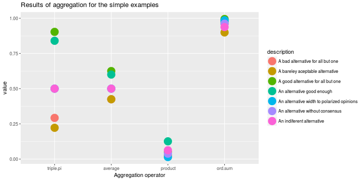

An App to show some simple aggregation operators
========================================================
author: Julio Waissman Vilanova
date: April 17, 2017
autosize: true

What is this?
========================================================

Aggregation and fusion of information are basic concerns for all kinds of knowledge based systems. From a general point of view we can say that aggregation has for purpose the simultaneous use of different pieces of information in order to come to a conclusion or a decision. 

This site aims to show and review the differences of 4 aggregation operators, which represent very different points of view. For this we assume that a group of 4 experts in an area are asked to evaluate different alternatives with a value between 0 and 1.

- The [app](https://juliowaissman.shinyapps.io/simple-aggregation/) is hosted in [shinyapps.io](http://www.shinyapps.io/)
- The [source code](https://github.com/juliowaissman/aggregation-simplicia) is hosted in [github](http://github.com)

Aggregation operators presented
========================================================

- A mutually reinforcing operator: 
$$
F(x_1, \ldots, x_n) = \frac{\prod_{i=1}^n x_i}{\prod_{i=1}^n x_i + \prod_{i=1}^n 1 - x_i}
$$
- An averaging operator: 
$$
F(x_1, \ldots, x_n) = (1/n)\sum_{i=1}^n x_i 
$$
- A disjunctive operator: 
$$
F(x_1, \ldots, x_n) = \prod_{i=1}^n x_i
$$
- A conjunctive operator: 
$$
F(x_1, \ldots, x_n) = 1 - \prod_{i=1}^n 1 - x_i
$$

A example of alternatives
========================================================

The data frame represents a serie of alternatives evaluated by 4 experts

| id|description                                | expert.1| expert.2| expert.3| expert.4|
|--:|:------------------------------------------|--------:|--------:|--------:|--------:|
|  1|A good alternative for all but one         |      0.7|      0.8|      0.9|      0.1|
|  2|A bad alternative for all but one          |      0.2|      0.3|      0.3|      0.9|
|  3|A bareley aceptable alternative            |      0.4|      0.3|      0.6|      0.4|
|  4|An alternative good enough                 |      0.6|      0.5|      0.7|      0.6|
|  5|An alternative width to polarized opinions |      0.9|      0.8|      0.2|      0.1|
|  6|An alternative without consensus           |      0.2|      0.4|      0.6|      0.8|
|  7|An indiferent alternative                  |      0.5|      0.5|      0.5|      0.5|

It is assumed that all the expert has the same importance

Results
========================================================

You can play with your own alternatives in the [app](https://juliowaissman.shinyapps.io/simple-aggregation/)!
